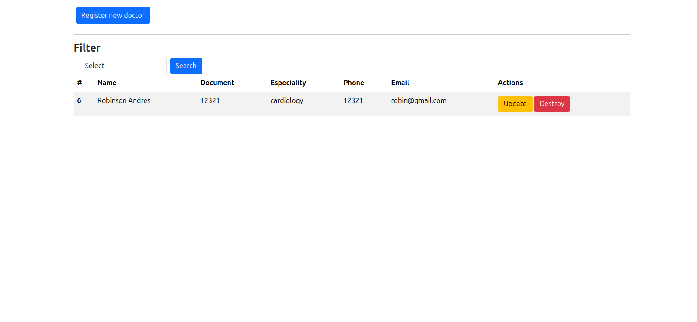
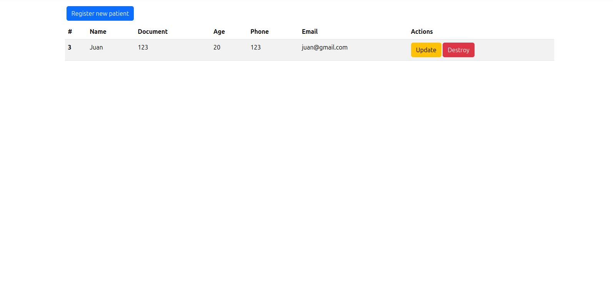
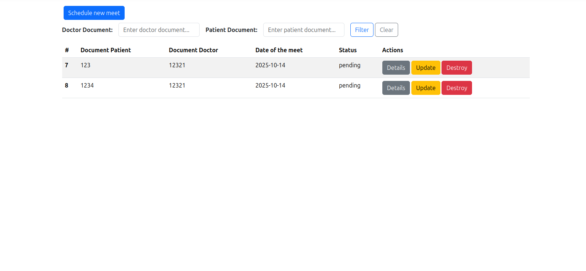

# 🏥 **San Vicente Hospital - Medical Appointment Management System**

**Name:** Juan Jose Hernandez Martinez  
**Clan:** Van Rossum / C# PM  
**Email:** juaan.josehernandez@gmail.com  
**ID:** 1020430413

## General Description of the System

The San Vicente Hospital system is a web application developed with ASP.NET Core MVC that facilitates the management of medical appointments between doctors and patients.  
Its main goal is to streamline the administration of medical encounters (creation, viewing, updating, and deletion of appointments) and optimize the organization of information within the hospital.

The system allows:

- Managing doctors and patients (create, list, update, and delete).
- Scheduling new medical appointments between both.
- Validating availability to avoid appointment overlaps.
- Filtering appointments by doctor or patient ID.
- Managing appointment statuses: Pending, Attended, Canceled.

The primary role interacting with the system is the **Administrator**, who has full control over the management of medical appointments.

---

## Steps to Clone, Configure, and Run the Application

Update Dependencies:
```
sudo apt update && sudo apt upgrade -y
```
Install EF (Entity Framework):
```bash
dotnet add package Microsoft.EntityFrameworkCore
```

Install PostgreSQL provider and Npgsql driver:
```bash
dotnet add package Npgsql.EntityFrameworkCore.PostgreSQL
```

Clone the repository

```bash
git clone https://github.com/tu-usuario/Assesment_csharp.git
cd Assesment_csharp
```
- Copy and paste the script into your PostgreSQL database.

- Go to appsettings.json and in the DefaultConnection line, replace the connection string with your database connection.

## Imgae to administrate doctors


## Image to administrate patients


## Image to administrate appointments

